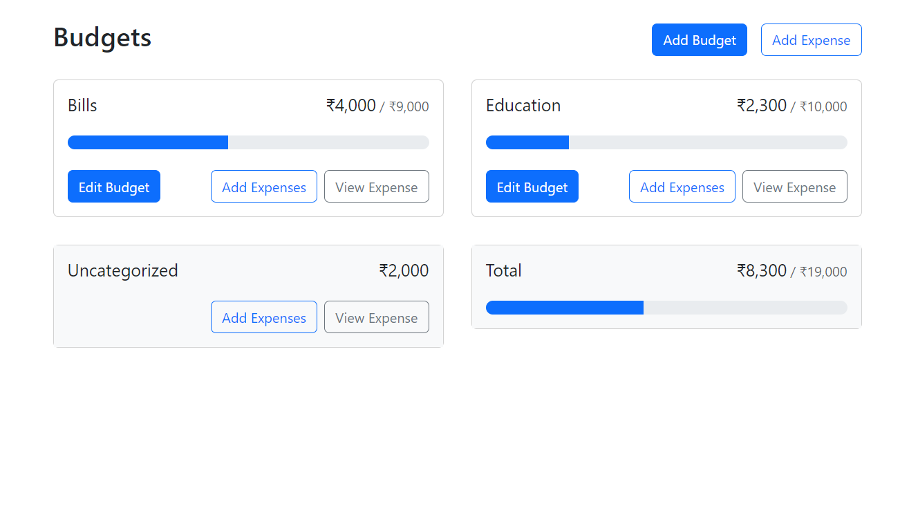
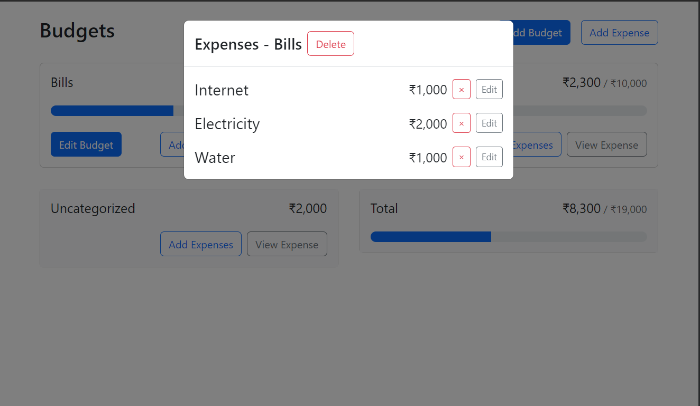

# React Budget App

<p align="center">
  
</p>

## Overview

Welcome to the Budget App, a feature-rich budget management application built using React.js, the Context API for state management, and Bootstrap for a sleek and responsive design. This app empowers users to effortlessly manage their budgets and expenses with intuitive features and a user-friendly interface.

## Features

1. **Add Budget:**

   - Easily create a new budget by providing a name and setting a maximum amount.

2. **Add Expense:**

   - Add detailed expenses with descriptions, amounts, and categories, seamlessly organized within specific budgets.

3. **Delete Budget and Expense:**

   - Enjoy the flexibility of deleting both entire budgets and individual expenses effortlessly.

4. **Edit Budget:**

   - Modify budget details such as name and maximum amount with a simple editing interface.

5. **Edit Expense:**

   - Update individual expense details, including descriptions, amounts, and categories, to keep your records accurate.

6. **Local Storage:**
   - Your data is securely stored locally using the browser's local storage, providing a seamless and persistent user experience across sessions.

## Screenshots



## Live Demo

Explore the live demo [here](https://meek-crepe-a3bdc7.netlify.app/).

## Getting Started

To run this project locally, follow these steps:

1. **Clone the repository:**
   ```bash
   git clone https://github.com/your-username/budget-app.git
   ```
2. **Navigate to the project directory:**
   ```bash
   cd budget-app
   ```
3. **Install dependencies:**
   ```bash
   npm install
   ```
4. **Start the development server:**
   ```bash
   npm run dev
   ```

## Tech Stack

- **React.js:** 🚀 A powerful and flexible JavaScript library for building user interfaces.
- **Context API:** 🧠 A state management solution for React applications, ensuring efficient data flow.
- **Bootstrap:** 🎨 A sleek and responsive CSS framework, enhancing the app's visual appeal.

## Contributing

We welcome contributions to enhance the Budget App! If you find any issues or have suggestions, please open an issue or create a pull request. 🙌
